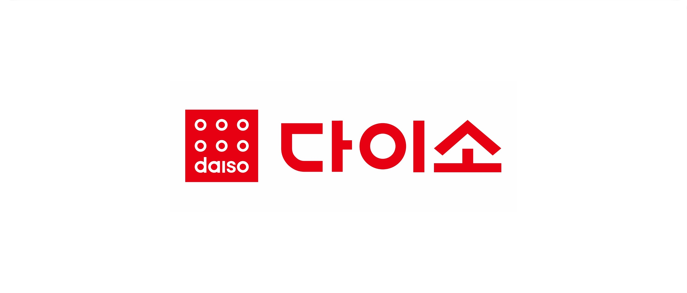
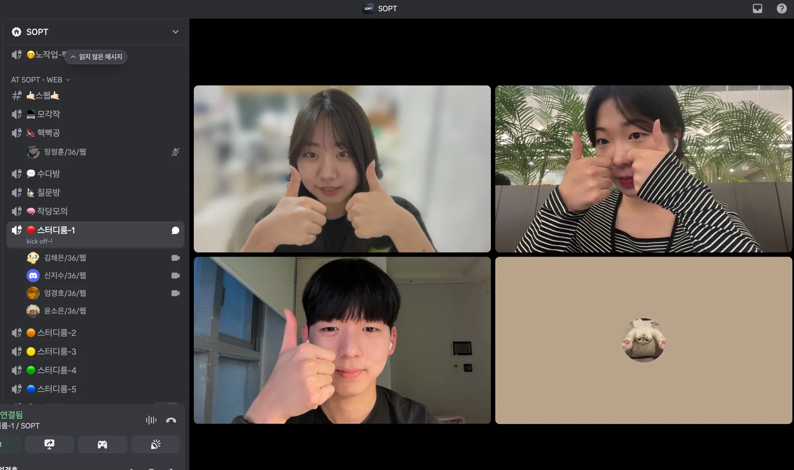

# 다이소몰 모바일웹 4조 🛒❤️

<br/>

<p align="center">
  
</p>

<br/>

<p align="center">
  
</p>

<br/>

## 프로젝트 소개

**다이소몰 모바일웹 4조**는 2030 여성 타겟의 합리적 소비와 오프라인-온라인 연계 경험을 극대화하기 위해
다이소몰의 상품 검색, 매장 재고 확인, 인기 상품 탐색, 직관적 UI/UX를 제공하는 모바일 웹 프로젝트입니다.

- **주요 타겟**: 2030 여성, 자취생, 1인가구  
- **핵심 경험**: 오프라인 매장 재고 확인, 빠른 상품 탐색, 인기 카테고리(화장품/리빙) 중심  
- **UX 개선 포인트**:  
  - 복잡한 UI 단순화  
  - 재고/매장/배송 필터링  
  - 오프라인-온라인 연계 강화  
  - 하단바/탭 구조 개선
 
<br/>

## 👥 팀원 및 역할 분담

| 엄경호 | 신지수 | 윤소은 | 김채은 |
| :---: | :---: | :---: | :---: |
| [@maehwasoo](https://github.com/maehwasoo) | [@shinjigu](https://github.com/shinjigu) | [@Dubabbi](https://github.com/Dubabbi) | [@bongtta](https://github.com/bongtta) |

<br/>

## 역할 분담 및 구현 파트 소개

### 🧑🏻‍🌾 엄경호
- 최고의 리드.

| 종류 | 목록 |
| --- | --- |
| setting ⚙️ | `svg 세팅` `스타일 커스텀 (theme, global)` `router 설정` |
| view 📱 | `제품 상세페이지` |
| api 📡 | `GET - 상품 상세 조회`<br>`GET - 상품 리뷰 조회` |

### 🌏 신지수

| 종류 | 목록 |
| --- | --- |
| setting ⚙️ | `path alias` `이슈, PR 템플릿 생성` |
| view 📱 | `매장 상품 찾기 - 인기` `매장 상품 찾기 - 검색` |
| api 📡 | `GET - 상품 검색 (상품명, 품번, 브랜드)`<br>`GET - 상품 정렬 (최신순, 가격 낮은 순, 가격 높은 순)`<br>`GET - 지금 많이 찾는 상품 조회` |

### 🪼 윤소은

| 종류 | 목록 |
| --- | --- |
| setting ⚙️ | `husky 설정` |
| view 📱 | `홈` `매장 상품 찾기 - 재고` |
| api 📡 | `GET - 상품별 매장 재고 기본 조회`<br>`GET - 매장명으로 검색` |

### 🪽 김채은

| 종류 | 목록 |
| --- | --- |
| setting ⚙️ | `TanStackQuery세팅` `Eslint 설정` `Prettier 설정` `axios 세팅` |
| view 📱 | `제품 상세페이지` |
| api 📡 | `GET - 브랜드별 상품 조회`<br>`GET - 상품 카테고리별 조회` |

<br/>

## 🛠️ 기술 스택

- **React** + **TypeScript** + **Vite**
- **Emotion CSS** (스타일)
- **TanStack Query(React Query)** (데이터 패칭)
- **Axios** (API 통신)
- **ESLint + Prettier** (코드 스타일)
- **Vercel** (배포)

<br/>

## 📁 폴더 구조

```plaintext
|-- src
|   |-- apis
|   |-- assets
|   |-- components
|   |   |-- @common
|   |-- hooks
|   |   |-- queries
|   |-- pages
|   |-- constants
|   |-- types
|   |-- styles
|   |-- utils
|-- .github
|-- .eslintrc.cjs
|-- .husky
|-- .gitignore
|-- .prettierrc
|-- index.html
|-- package.json
|-- README.md
|-- tsconfig.json
|-- vite.config.ts
|-- yarn.lock
```

<br/>

## 🧑‍💻 컨벤션

### Git 브랜치 전략

- `main` (배포)
- `develop` (통합 개발)
- `feat/#이슈/기능명` (기능별)

### Commit 메시지

- `feat: 새로운 기능 추가`
- `fix: 버그 수정`
- `refactor: 리팩터링`
- `docs: 문서 수정`
- `style: 스타일 변경`
- `chore: 설정/빌드`
- `test: 테스트 코드`
- `init: 초기 세팅`
- `code review: 코드 리뷰 반영`

### PR 컨벤션

```
[TYPE] 작업 내용 #이슈번호

## 📌 관련 이슈
- close #이슈번호

## 📄 작업 내용
- 작업 내역

## 🔍 리뷰 포인트
- 리뷰어가 집중해서 봐야 할 부분
```

### Issue 컨벤션

```
[FEAT] 기능명

## 📄 TASK
- 주요 작업

## ✅ TO DO
- [ ] 세부 작업
```

<br/>

## 📝 코딩 컨벤션

### 컴포넌트
- 함수형 컴포넌트는 `rafce` 스니펫 사용, 파일명은 PascalCase
- 리액트 컴포넌트만 PascalCase, 그 외는 camelCase
- props 타입은 `~Props`로 명명, 컴포넌트 파일 내에서 선언
- 의미 없는 div 또는 컴포넌트 최상단은 fragment(`<> </>`) 사용
- children이 불필요할 땐 self-closing 사용 `<Component />`
- 컴포넌트 선언과 스타일드 컴포넌트 선언 사이 한 줄 띄우기
- 주석은 설명하려는 대상 바로 위에 작성

### 폴더/파일명
- 폴더명, 파일명은 소문자, 복수형, 카멜케이스
- 공통 컴포넌트는 `components/common`에, 페이지 전용 컴포넌트는 각 페이지 폴더에 위치

### 타입
- props 타입은 `~Props`, 공통 타입은 `types` 폴더에 선언
- api response 타입명은 `OOOResponseTypes`
- interface는 확장, type은 union/intersection에 사용

### 변수/상수
- var 금지, const 우선 사용
- 상수는 대문자 스네이크케이스 (`API_KEY`)
- boolean 변수는 is/has 접두사 사용 (`isActive`, `hasEmail`)
- 배열은 복수형, map 사용 시 key는 고유값

### 함수
- 함수명은 동사+명사, 이벤트 핸들러는 `handle` 접두사
- 유틸 함수는 반환값 기준 네이밍, 공통은 `utils` 폴더에
- 화살표 함수 우선 사용

### 스타일
- 스타일 파일명은 `OOO.style.ts`로 통일
- Styled-Component 네이밍: Wrapper/Layout/Container/Box 등 역할 명확히
- 시맨틱 태그 적극 활용, 단위는 rem, border 등은 px
- color, font는 theme 사용

### 기타
- map 등 반복문 key는 index 대신 고유값
- 불필요한 반복문 대신 filter, includes 등 적극 사용
- 코드 스타일은 Prettier, ESLint로 통일
